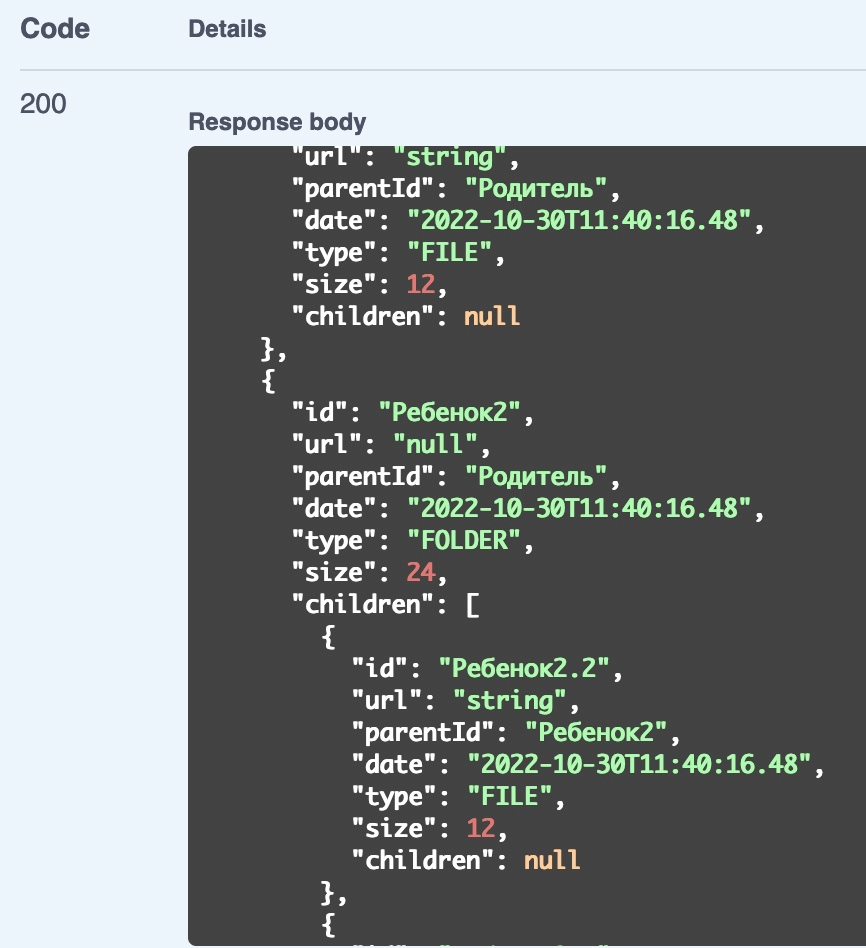

# Описание:
REST API сервис, который позволяет пользователям загружать и обновлять информацию о файлах и папках.
Идея проекта взята из школы бэкенд разработки яндекса, однако в проект будет добавлен новый функционал.
### Технологии
- Java
- Spring Boot
- JDBC
- Графовая база данных neo4j
- OpenApi Swagger
- Docker
- Логирование с помощью slf4j

### Функционал:
- Загрузка элементов в файловую систему
- Получение элементов файловой системы в **иерархическом** порядке

  
- Каскадное удаление элементов из файловой системы

К контроллеру добавлен **OpenApi Swagger**. По следующему адресу можно посмотреть документацию по данному сервису.
```
http://localhost:8080/swagger-ui/index.html
```

В планах добавить в проект user-service с **реляционной базой данных** для работы с пользователями, и реализовать хранение истории обновлений.

### Инструкция по запуску проекта
Для контейнеризации был использован **Docker**.
В корне проекта находится файл docker-compose.yml,
который разворачивает на localhost два контейнера.
В первом контейнере находится образ субд neo4j,
во втором крутится REST-API сервис для работы с диском.

1. Распаковать архив с решением
2. В корне проекта, где находится файл ```docker-compose.yml``` открыть терминал
3. В терминале прописать ```docker-compose build```
4. После билда прописать ```docker-compose up```
   После данных действий всё приложение развернётся на вашей системе и
можно будет совершать запросы к сервису по ```http://localhost:8080/...```

